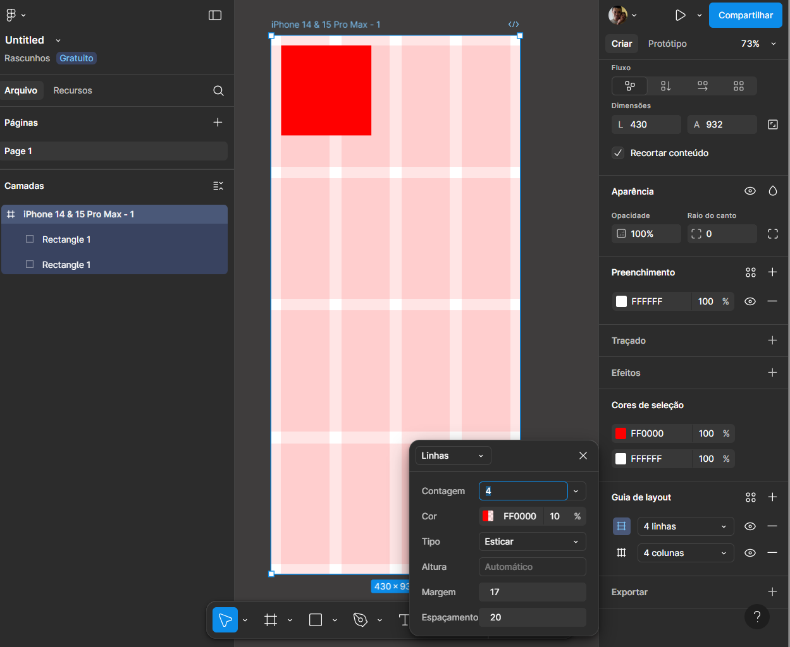
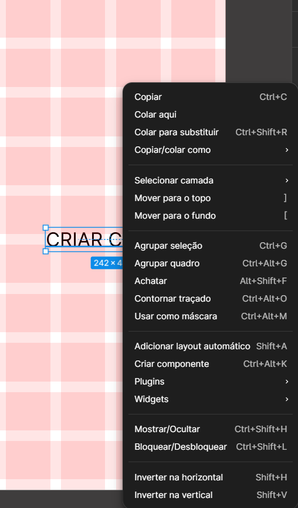
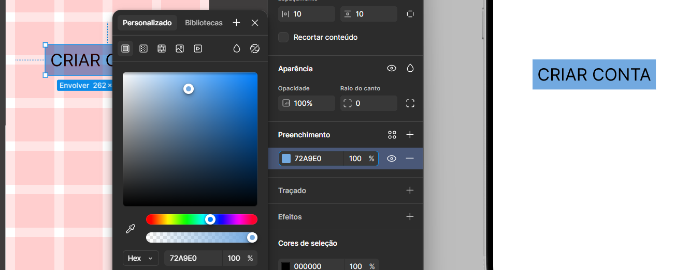

# Aula de Designer - Figma

Ferramentas para e atalho para usar.

- Letra K = ferramenta de escala.

## Iniciando o Designer

01. Para Iniciar vai em Designer.

02. Escolha a tela por exemplo, celular 3D max.

03. Para organizar e melhora o alinhamento escola GUIA DE LAYOUT, e clique em mais. Quando finalizar a linha Adicionar novamente para poder colocar mais (culinas e Linhas)
Isso server para encontrar as margens para fica dentro do tela do aplicativo

- Escolha Culuna -> 
    - colocar 4 
    - margem 20
    - espaçamento 20
- Escolha Linha ->
    - colocar 10
    - margem 20
    - espaçamento 20

04. Após criar um texte e centralizar depois de criar a margem, vamos tansformar o texto em uma botão. Clique com botão direito do mouse e Adicionar Layout.

- Depois pode procurar o preenchimento e colocar um cor.

