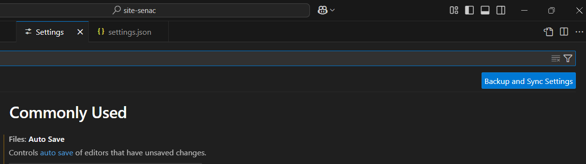
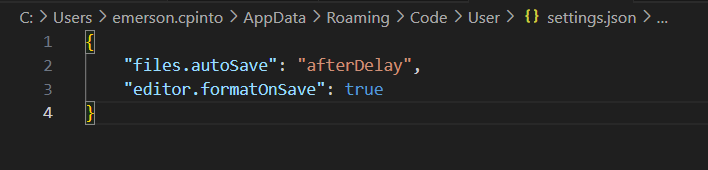

# Comando pra iniciar

Como instalar para React para fazer utilização do projeto.

1. Abrir Executar e digitar CMD.

2. Verificar o Note.
`node --version`

3. Para ver NPM.
`npm --v`
obs: lembrar no Studo Code na linha de comando mudar para Command promt no + (mais) - Outra Observação para criar na pasta já determinada é só colocar o comando `npm create vite@latest .`

4. Instalar o vite.
`npm install vite -g`

5. Volta para C: 
com comando `cd\`
apagar `cls`

6. Para fazer a criação da pasta.
`md projetos`

7. Para acessar a pasta
`cd "projetos"`

8. Depois de criar a pasta vamos criar um projeto em React
`npm create vite@latest` - se já for determinado a pasta no GitHub é só usar o comando `npm create vite@latest .` - ai depois só ignorar os arquivos.

9. Criar um nome do projeto
`site-senac`

10. Selecionar o Framework
`React`

11. Selecionar o variante.
`JavaScritp`

12. Após a finalização seguir os passos para fazer a instalação que está pedindo.
- **Acessar:** `cd site-senac`
- **Instalar:** `npm install`
- **Executar:** `npm run dev`
depois disse irá mostra a instalação do projeto, e abri no browser.
Exemplo: http://localhost:5173/

13. Para finalizar.
`code .`

## No Code da para fazer instalação de nova bicliotecas

1. Instalação de Bootstrap.
`npm install bootstrap`

2. Instalação de Bootstrap icon.
`npm install bootstrap-icons`

3. Para remoção da bicliotecas
`npm uninstall bootstrap`

## Instalar as extenções no Visual Code.

- **Error Lens**
- **ES7 + React/redux**
- **IntellSense for CSS**
- **Portuguese(Brasil)**
- **Simples React Snippets**
- **VSCode-icons**
     

## Comando para poder Organizar automáticamento o código

- Dar um CONTROL + , 

Com isso vai abrir configuração.

clicar na Folha no conto direito, lá cima

Colocar o código abaixo.

"editor.formatOnSave": true

