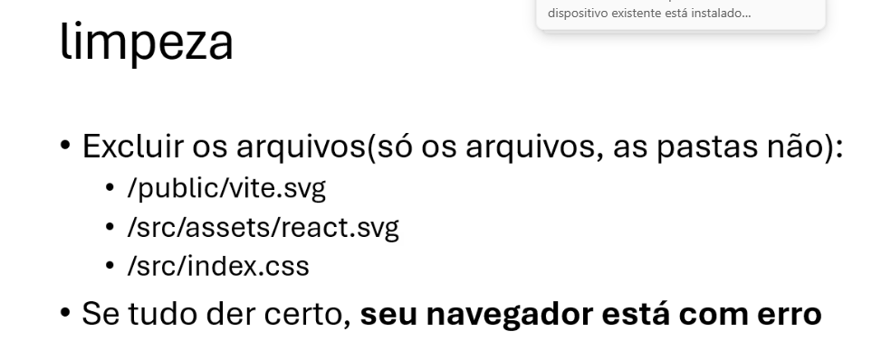
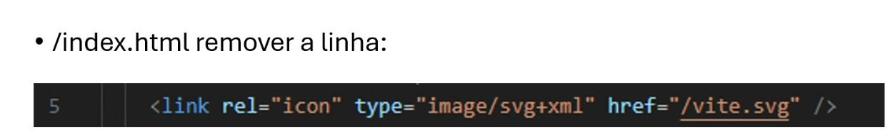
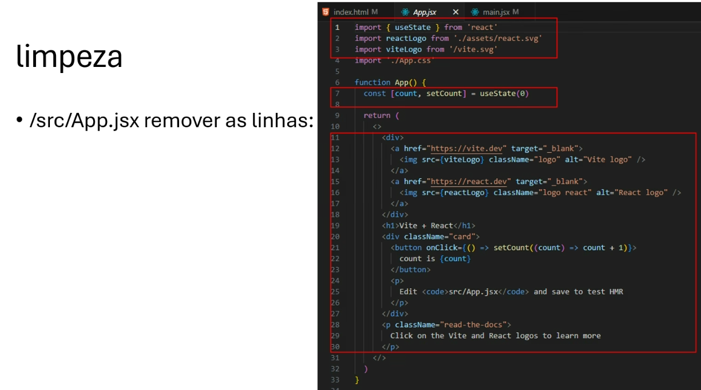

# React + Vite

*Lembrar de acessar a pasta onde está salva se não criar uma novo*

This template provides a minimal setup to get React working in Vite with HMR and some ESLint rules.

Currently, two official plugins are available:

- [@vitejs/plugin-react](https://github.com/vitejs/vite-plugin-react/blob/main/packages/plugin-react) uses [Babel](https://babeljs.io/) for Fast Refresh
- [@vitejs/plugin-react-swc](https://github.com/vitejs/vite-plugin-react/blob/main/packages/plugin-react-swc) uses [SWC](https://swc.rs/) for Fast Refresh

## Expanding the ESLint configuration

If you are developing a production application, we recommend using TypeScript with type-aware lint rules enabled. Check out the [TS template](https://github.com/vitejs/vite/tree/main/packages/create-vite/template-react-ts) for information on how to integrate TypeScript and [`typescript-eslint`](https://typescript-eslint.io) in your project.

# Comando para usar no Github, para commit

01. git add .

02. git commit -m "Texto para colocar descrição"

03. git push origin main

# Limpeza do Projeto

Precisa limpar os arquivos para poder iniciar, delete os arquivos dentro da pasta.



Continuar removendo



Continuar removendo


Continuar removendo



Continuar removendo


## Criação da página 
Para criação de um do conteudo, pode ser criado as páginas no caso, em SRC/ASSETS como exemplo, 
- *Card.css* para colocar  conteudo de CSS
- *Card.jsx* para colcoar o conteudo de HTML

## Programando a página
No arquivo APP.JSX tem que trazer o card para trazer quantas vezes quiser.

```
function App() {

  return (
    <>
      <Card />
      <Card />
      <Card />
    </>
  )
}
```